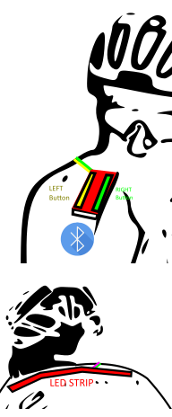

# signelo

Signelo is a bike light controlled by bluetooth

* Control with a smartphone
* Two buttons
* [Optional] RF Remote

# Bill of Materials
* Lolin D32
* Lipo 2000mAh battery
* A smartphone
* Neopixels (WS2812b) Led strips (32 leds)
* 2 buttons

# Mobile Applications

We are going to use MIT APP INVENTOR

* [Software](https://appinventor.mit.edu/)
* [Bluetooth Low Energy Extension](http://iot.appinventor.mit.edu/#/bluetoothle/bluetoothleintro)

